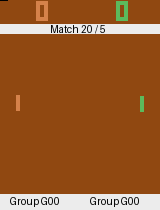
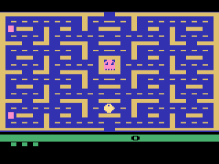

Authors: Mustapha El Aichouni Jouied, Miguel Arpa Robig
# RL_PARADIGMS

Create python environment Python 3.11

pip install uv

uv sync

uv run python script.py

uv add package

uv init --> create a new project

## Part 2: Pong Tournament
Deep Reinforcement Learning agents trained to play Atari Pong with **Stable-Baselines3**.



## Part 3: Pacman Reinforcement Learning

Deep Reinforcement Learning agents trained to play Atari Pacman using **A2C** and **PPO** algorithms with **Stable-Baselines3**.




---

## ✨ Features

- **Multiple RL Algorithms**: A2C and PPO implementations
- **Hyperparameter Optimization**: Automated tuning with Optuna
- **Parallel Training**: Multiple environments for faster training
- **DeepMind-style Wrappers**: Frame stacking, reward clipping, NoOp reset
- **WandB Integration**: Real-time monitoring and logging
- **Custom Ghost Detection**: Hybrid life detection system
- **Evaluation Tools**: Performance analysis and video generation
- **GPU Support**: CUDA acceleration for faster training

---

## 📁 Project Structure

```
pacman/
├── config.py                 # Configuration and hyperparameters
├── train.py                  # Main training script
├── wrappers.py              # Environment wrappers
├── evaluation.py            # Model evaluation tools
├── video.py                 # Video generation utilities
├── positions.py             # Position analysis tools
├── requirements.txt         # Python dependencies
├── run_pacman.sh           # Training launch script
├── run_PPO_cpu.sh          # CPU-specific training script
├── optuna_best_params.txt  # Best hyperparameters found
└── README.md               # This file

models/                      # Saved models
├── a2c/
│   ├── best/
│   ├── checkpoints/
│   └── final/
└── ppo/
    ├── best/
    ├── checkpoints/
    └── final/

results/                     # Training outputs
├── logs/                    # TensorBoard logs
├── videos/                  # Gameplay recordings
└── plots/                   # Performance graphs
```

---

## 🚀 Installation

### Prerequisites

- Python 3.8 - 3.10
- CUDA 11.8+ (optional, for GPU acceleration)
- 8GB+ RAM
- 10GB+ disk space

### Step 1: Clone Repository

```bash
git clone <repository-url>
cd pacman
```

### Step 2: Create Virtual Environment

```bash
# Linux/Mac
python -m venv venv
source venv/bin/activate

# Windows
python -m venv venv
venv\Scripts\activate
```

### Step 3: Install Dependencies

```bash
pip install --upgrade pip
pip install -r requirements.txt
```

### Step 4: Verify Installation

```bash
python -c "import gymnasium; import stable_baselines3; import torch; print('✅ Installation successful!')"
```

---

### Using Bash Scripts

```bash
# PPO on GPU
bash run_pacman.sh

# PPO on CPU
bash run_PPO_cpu.sh
```

---

### Training Configuration

Edit `config.py` to modify:

```python
TOTAL_TIMESTEPS = 20_000_000  # Total training steps
EVAL_FREQ = 500_000           # Evaluation frequency
N_EVAL_EPISODES = 10          # Episodes per evaluation
SAVE_FREQ = 500_000           # Checkpoint frequency
```

### Monitoring Training

**TensorBoard:**
```bash
tensorboard --logdir results/logs
```

**WandB:**
- Login: `wandb login`
- View dashboard at [wandb.ai](https://wandb.ai)

---

## 🔬 Hyperparameter Optimization

### Run Optuna Study

```bash
python train.py \
    --typem ppo \
    --optimize \
    --trials 100 \
    --hpo-timesteps 1000000 \
    --n-envs 4
```

### View Optimization Results

After optimization completes, best parameters are displayed:

```
Best trial: 23
Best reward: 1842.50

Best hyperparameters:
  learning_rate: 2.08e-05
  n_steps: 2048
  batch_size: 128
  gamma: 0.9867
  ...
```

---

### Generate Videos

```bash
python video.py \
    --model-path models/ppo/best/best_model.zip \
    --n-episodes 5 \
    --output-dir results/videos
```

## ⚙️ Configuration

### A2C Hyperparameters (config.py)

```python
A2C_PARAMS = {
    "learning_rate": 5.26e-05,
    "n_steps": 512,
    "gamma": 0.986,
    "gae_lambda": 0.968,
    "ent_coef": 0.00014,
    "vf_coef": 0.479,
    "max_grad_norm": 1.0,
    "normalize_advantage": True,
}
```

### PPO Hyperparameters (config.py)

```python
PPO_PARAMS = {
    "learning_rate": 2.08e-05,
    "n_steps": 2048,
    "batch_size": 128,
    "n_epochs": 10,
    "gamma": 0.9867,
    "gae_lambda": 0.9222,
    "clip_range": 0.29,
    "ent_coef": 1.27e-4,
    "vf_coef": 0.88,
    "max_grad_norm": 0.82,
    "normalize_advantage": True,
}
```

### Environment Wrappers (wrappers.py)

- **NoopResetEnv**: Random initial no-op actions (1-30)
- **GhostLifeEnvHybrid**: Smart ghost death detection
- **MaxAndSkipEnv**: Frame skipping (4 frames)
- **ResizeAndGrayScale**: 84x84 grayscale conversion
- **ClipRewardEnv**: Reward clipping to {-1, 0, 1}
- **MaxEpisodeSteps**: Hard episode limit (6000 steps)

## 📚 Additional Resources

### Documentation

- [Stable-Baselines3 Docs](https://stable-baselines3.readthedocs.io/)
- [Gymnasium Atari](https://gymnasium.farama.org/environments/atari/)
- [Optuna Documentation](https://optuna.readthedocs.io/)
- [WandB Guides](https://docs.wandb.ai/)

### Papers

- **A2C**: [Asynchronous Methods for Deep RL](https://arxiv.org/abs/1602.01783)
- **PPO**: [Proximal Policy Optimization](https://arxiv.org/abs/1707.06347)
- **Atari Preprocessing**: [Human-level control through deep RL](https://www.nature.com/articles/nature14236)

---

## 📝 License

This project is for educational purposes. Atari ROMs are subject to their respective licenses.

---

